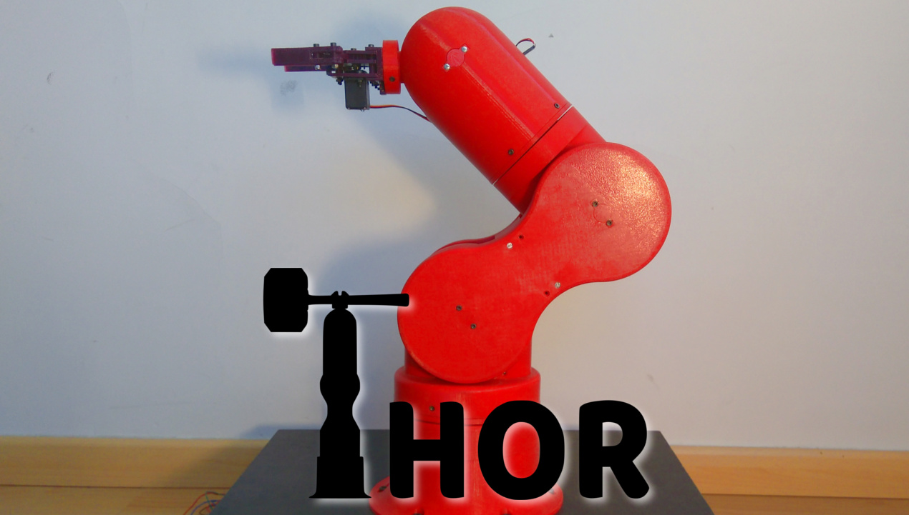

<a href="http://thor.angel-lm.com/">

</a>

**Thor** is an Open Source and printable robot arm with six degrees of freedom.
Its configuration (yaw-roll-roll-yaw-roll-yaw) is the same used by most of the manipulator robots on the market.
In its extended position, Thor is about 625mm high and can lift loads up to 750 grams.

The project started in 2015 as a final degree project called “Design and impplementation of an Open Source, 3D printed 6DOF robotic arm”. Since then, this project has continued to develop little by little.

The main purpose of this project was to design a robot that could be used in universities and schools to teach robotics.With this in mind, the design had to be affordable and accessible. Releasing the source files and doing so under an open source licence was the best option: anyone could study any element of the robot in depth and, moreover, modify or adapt it to their needs.

The cost of the whole materials is under 350€. Being so affordable, I think almost every school/university/maker could make good use of at least one!

In terms of licenses, I wanted this project to be Open Source because I want anyone to have the opportunity to study, modify and improve it. 

Thor has been developed using only open source tools: [FreeCAD](https://www.freecadweb.org/) for the 3D modeling, [KiCAD](https://www.kicad.org/) for the PCB design and [GBRL](https://github.com/gnea/grbl) as firmware for the control electronics. In this way, access to knowledge can be guaranteed to anyone, anywhere, without any economic cost. There is not a single reason for not hacking Thor!

If you want to know more about this project, visit the [Thor Website](http://thor.angel-lm.com/), where you will find documentation, manuals and a forum to solve all your doubts.

# Repository Index
* [doc](https://github.com/AngelLM/Thor/tree/developer/doc) - Misc documentation files
* [freecad-src](https://github.com/AngelLM/Thor/tree/developer/freecad-src) - FreeCAD source files of every piece of Thor
* [step](https://github.com/AngelLM/Thor/tree/developer/step) - step files of every piece of Thor
* [stl](https://github.com/AngelLM/Thor/tree/developer/stl) - stl files of every piece of Thor
* [wiki](https://github.com/AngelLM/Thor/wiki/) - currently deprecated, for updated info visit the [project's website](http://thor.angel-lm.com/)
  * [FAQ](https://github.com/AngelLM/Thor/wiki/FAQ) - Frequently Asked Questions
  * [Component list & Where to buy](https://github.com/AngelLM/Thor/wiki/Component-list) - List of every component needed in this project and links to online shops where they can be bought.
  * [ThorBuilders](https://github.com/AngelLM/Thor/wiki/List-of-Thor-Builders) - List of Thor builders

# License

<a href="https://creativecommons.org/licenses/by-sa/4.0/legalcode">

</a>

All files included in this repository are licensed under a [Creative Commons Attribution-ShareAlike 4.0 International License](https://creativecommons.org/licenses/by-sa/4.0/legalcode) 
