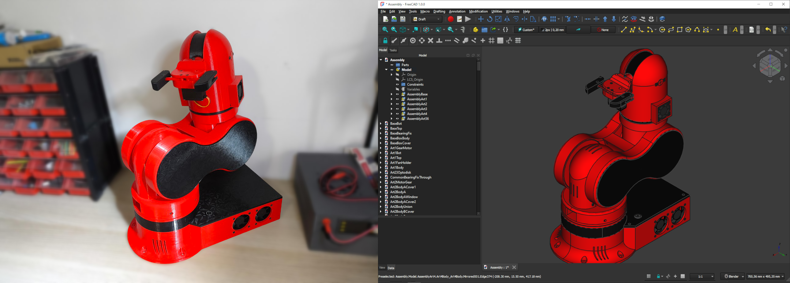

<h1 align="center">
 <a href="http://thor.angel-lm.com">
    <picture>
      <source height="80" media="(prefers-color-scheme: dark)" srcset="doc/logo_dark.svg">
      
    </picture>
  </a>

  

 
 
 
 
 
</h1>

 <em><b>Thor</b> is an open source, 3D printed, 6 degrees of freedom robotic arm. Designed to be affordable and accessible, Thor is ideal for educational settings, makers, and robotics enthusiasts. With a height of 625mm it has the capacity to lift up to 750g. Its yaw-roll-roll-yaw-roll-yaw configuration is common in industrial manipulators.</em>

 

## ✨ Key Features

- 🧩 **Born Open Source**: Designed using open source software such as FreeCAD, KiCAD, GRBL, RRF and ROS.
- 🕊️ **Released Open Source**: All source files published under CC-BY-SA-4.0 license.
- 💰 **Low Cost**: Hardware cost below 350€.
- 📚  **Suitable for education**: Perfect for robotics courses in schools and universities, there are already success cases!
- 🧰 **G-code Controlled**: Uses the same language as 3d printers and CNCs to move.
- 🐳 **ROS2 Integration**: Available implementation using Docker for flexibility.

## 📦 Repository Structure
- `freecad-src` – Source files of 3D models created with FreeCAD
- `mods` – Modified models and improvements to standard models
- `stl` – Printable STL files
- `step` – STEP files

## 🔗 Related Repositories
- [**Thor-ROS**](https://github.com/AngelLM/Thor-ROS): ROS2 & Moveit2 configuration files and packages to work with Thor.
- [**ThorControlPCB**](https://github.com/AngelLM/ThorControlPCB): Source & manufacture files of Arduino Mega shield designed to control Thor.
- [**Asgard**](https://github.com/AngelLM/Asgard): Control software for thor motors with a simple interface.

## 🚀 Getting Started

1. **Read the Documentation**: Comprehensive guides on printing, assembly, electronics, and firmware are available at [thor.angel-lm.com/documentation](http://thor.angel-lm.com/documentation/).
2. **Print the Parts**: Use the STL files in this repository.
3. **Get the Hardware**: Take a look to the [Bill of Materials](http://thor.angel-lm.com/documentation/bom/).
4. **Assemble the Robot**: See [here](http://thor.angel-lm.com/documentation/assembly/) for assembly videos and interactive instructions. 
5. **Assemble & Setup the Electronics**: The [Wiring & Setup](http://thor.angel-lm.com/documentation/electronics/) guide will help you prepare your electronic board and make the hardware connections. 
6. **Install the Firmware**: Depending on which electronics you have chosen, you will have to perform a different firmware configuration. [This page](http://thor.angel-lm.com/documentation/firmware/) explains the steps to follow.
7. **Control the Robot**: Use Asgard to move the robot. [Here](http://thor.angel-lm.com/documentation/control-software/) is how to do it.

## 🧠 Technical Specifications

- **Degrees of Freedom**: 6 (yaw-roll-roll-yaw-roll-yaw).
- **Height Stretched**: 625mm (without end effector).
- **Payload Capacity**: 750g max (including end effector weight).
- **Motors**: Stepper motors.
- **Electronics**: DIY PCB or commercial boards.
- **Transmission**: 3D printed gears, GT2 pulleys and belts.
- **Software**: FreeCAD, KiCAD, GRBL, RRF, ROS2.

## 📚 Additional Resources

- 🌐 **Official Website**: [thor.angel-lm.com](http://thor.angel-lm.com/)
- ❓ **Frequently Asked Questions**: [FAQ](http://thor.angel-lm.com/faq/)
- 💬 **Thor Community Forums**: [Thor Forums](http://thor.angel-lm.com/forums/)
- 💬 **Thor Discord Server**: [Thor Robot Community](https://discord.com/invite/a5dSVqSUK5)

## 🤝 Contributing

Contributions are welcome! If you'd like to improve Thor — whether it's design, documentation, or code — feel free to open an [Issue](https://github.com/AngelLM/Thor/issues) or submit a Pull Request.

## 📜 License

Thor is licensed under the [Creative Commons Attribution-ShareAlike 4.0 International License](https://creativecommons.org/licenses/by-sa/4.0/legalcode). You’re free to use, modify, and distribute this project under its terms.

## 🎥 Videos

